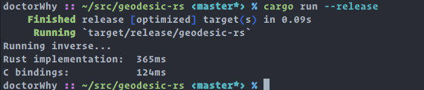

# geodesic-rs
A port of [geographiclib](https://geographiclib.sourceforge.io/) in Rust

This is still an early stage work in progress, if you need something that works I
found [these bindings](https://github.com/savage13/geographiclib) to be usable and fast.

This is a 1:1 port of the python implementation, which strictly resembles the C++ one, but it's more readable for me.

Both the `inverse` and `direct` algorithms are implemented, but they seem to be 3 times slower than the rust bindings
of the C implementation on my machine, but I think there is room for improvements.

# Try it
Since this is mostly a proof of work, the `main.rs` just runs both the
aforementioned geographiclib bindings and the ones implemented in this crate a lot of times with the same parameters,
and prints the execution times.

To run the benchmarks:
```
cargo run --release
```

Results on my pc:


